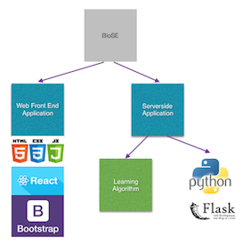
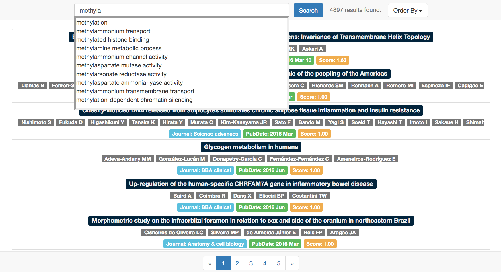

# BioSE

## Introduction

BioSE is a self-adaptive search engine for literatures in the bioinformatics field. It has some novel features to help the users find the papers they want quickly. The data comes from mainly PubMed, also Google Scholar. The application acts as a post processor for these sources.



## Features

### Self Adaptive

The ranking of papers is automatically being improved utilizing the users' clickthrough data. The papers which are more relevant to the search term will be ranked higher later. The result of cross validation suggests that the algorithm also has the ability to predict the importance of new papers.

### Instant Search

When the user types every character, the server will predict the phrases the users is likely to input based on GO terms and NCBI Tax. This is provided using

## Implementation

### Serverside

The server side application is a Python program, located in root directory. The web framework used is [Flask](http://flask.pocoo.org/).

### Frontend

The frontend application is mainly a Javascript program, along with some HTML and CSS code. [React.js](https://facebook.github.io/react/) is used to build this application.

### Underlying software

[redis](http://redis.io/), to provide instant search using sorted set

Any RDBMS, e.g. [SQLite](https://www.sqlite.org), [MySQL](https://www.mysql.com), [MariaDB](https://mariadb.org/)

## Deployment

Requirements: Python3

Platform: Linux and OS X preferred

You can use the following command to install the dependencies required by Python.

```bash
pip install -r requirements.txt
python3 -m src.helpers.mesh_parser
python3 -m src.helpers.goterm
```

## Demo
Demo is currently available at [biose.jie.today](https://biose.jie.today)

## Screenshot

